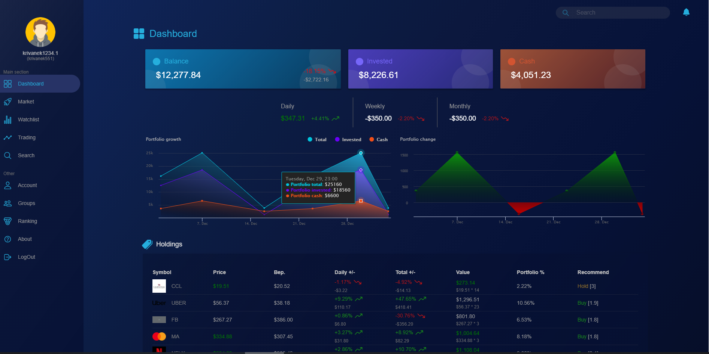
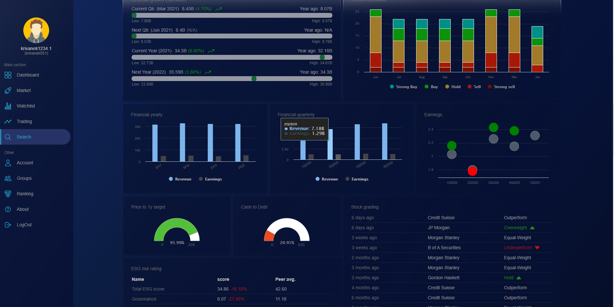

# stock_tracker

Application to analyze financial details about publicly listed companies. The initial idea came from aggregating stock market data from multiple endpoints into one system. The application was part of the 2022 [master thesis](documents/master_thesis_Eduard_krivanek.pdf) at Comenius University in Bratislava. Project is still in development, so some functions may not work correctly. 

Click to launch the [application](https://stock-tracker-prod.web.app/) 

